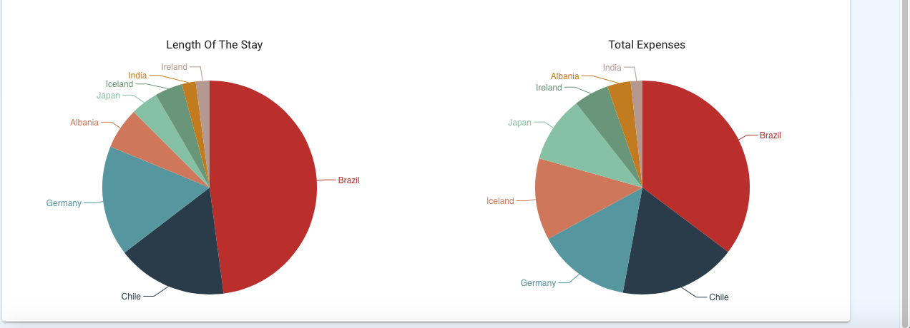
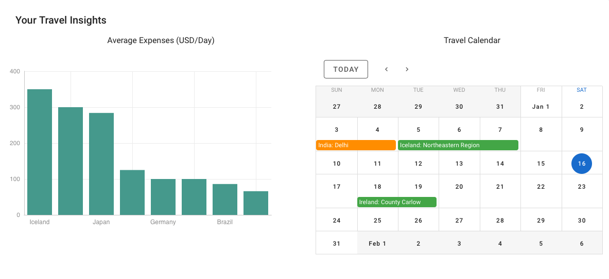
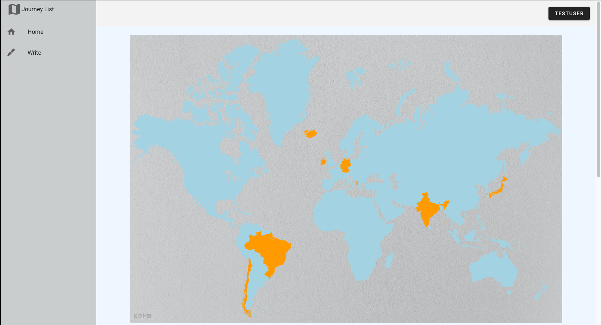
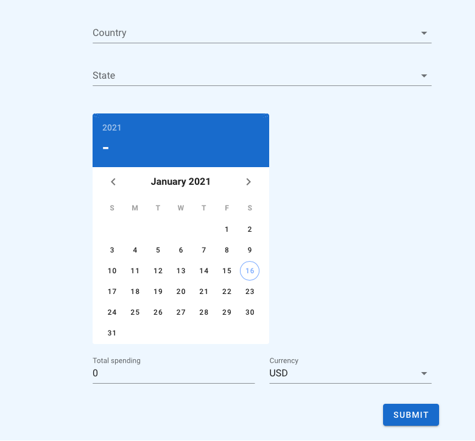

# frontend
## アクセス
url: https://brave-plant-06292c600.azurestaticapps.net  
スマホ非対応。ログイン出来ない時は時間を置いてもう一度お試し下さい。 
アカウント作成の手間を省いて動作確認をしたい場合は以下のユーザー名とパスワードを入力してログインしてください。  
ユーザー名: testuser  
パスワード: test

## 使用技術
言語: Vue.js, Vuetify  
サーバー: Azure Static Web Apps(CORSでバックエンドと連携)  
バックエンド連携: https://github.com/I-Root-Route/travel-web-app-backend

## 概要
### Home
旅の合計支出と滞在期間を以下のような円グラフとして表示。  

旅の国別平均支出の棒グラフ化と、カレンダーでの表示。  

訪れた国をオレンジで表示  

### Write
旅の結果を記録することができる。

